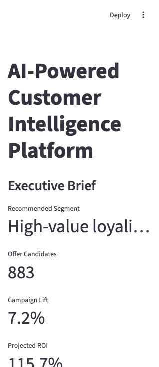
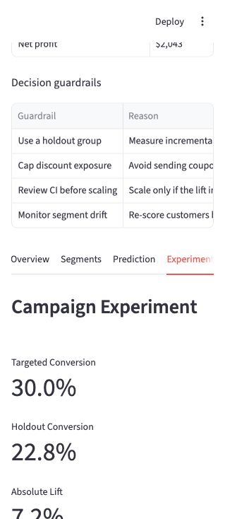
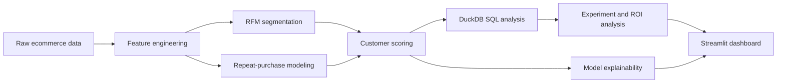

# Customer Intelligence & Campaign ROI Platform

[](https://github.com/HebeiZywoo/customer-intelligence-with-AI/actions/workflows/ci.yml)
[](https://www.python.org/)
[](LICENSE)

An end-to-end data science project that turns ecommerce customer data into retention strategy, campaign ROI estimates, and executive-ready recommendations.



## 30-Second Summary

This project answers a realistic business question:

> Which customers should an ecommerce team target next, and is the campaign worth scaling?

I built a full analytics and machine learning workflow using Python, DuckDB SQL, scikit-learn, Streamlit, and the Anthropic Claude API. The platform segments customers, predicts 60-day repeat purchase probability, explains model drivers, evaluates a campaign against a holdout group, estimates ROI, and summarizes the recommendation in an executive dashboard with a grounded Claude-powered analyst assistant.

## Results

| Area | Result |
|---|---:|
| Best repeat-purchase model | Random Forest |
| ROC AUC | 0.709 |
| Targeted conversion rate | 30.0% |
| Holdout conversion rate | 22.8% |
| Absolute campaign lift | 7.2 percentage points |
| 95% CI for lift | 2.5% to 11.8% |
| Projected ROI | 115.7% |
| Estimated net profit | $2,043 |

## Scope

The project covers the full decision workflow, not just model training:

- Framing a business decision.
- Building time-aware customer features.
- Using SQL to produce reusable reporting tables.
- Comparing models instead of relying on one classifier.
- Explaining why the model makes predictions.
- Evaluating campaign lift with a holdout group.
- Translating lift into revenue, margin, cost, and ROI.
- Communicating the recommendation through a dashboard and case study.

## Suggested Reading

If you want the story behind the project, start here:

1. Read the full case study: [docs/case_study.md](docs/case_study.md)
2. Review the model card: [docs/model_card.md](docs/model_card.md)
3. Check the data dictionary: [docs/data_dictionary.md](docs/data_dictionary.md)
4. Run the dashboard locally with the Quick Start below.

## Dashboard

The dashboard is designed around the way a stakeholder would consume the work:

- Executive Brief: recommendation, impact, ROI, and guardrails.
- Data Import: optional customer-level CSV upload for custom dashboard exploration.
- Overview: customer base, revenue, repeat rate, and marketing actions.
- Segments: RFM customer groups and segment-level performance.
- Prediction: model comparison, selected model metrics, and feature importance.
- Experiment: lift, confidence interval, p-value, ROI, and segment-level lift.
- SQL Insights: DuckDB-powered reporting tables.
- Analyst Assistant: grounded business Q&A — Claude-powered (Opus 4.8 / Sonnet 4.6 / Haiku 4.5, selectable) when an API key is configured, with a deterministic rule-based fallback otherwise.



## Technical Approach



## Project Structure

```text
.
├── app/
│   └── streamlit_app.py
├── data/
│   ├── raw/
│   └── processed/
├── docs/
│   ├── case_study.md
│   ├── data_dictionary.md
│   ├── interview_talk_track.md
│   ├── model_card.md
│   └── learning_guide_zh.md
├── sql/
│   └── customer_analysis.sql
├── scripts/
│   ├── generate_data.py
│   ├── run_sql_analysis.py
│   └── train_models.py
├── src/
│   └── customer_ai/
│       ├── assistant.py
│       ├── experiments.py
│       ├── features.py
│       └── modeling.py
├── tests/                  # pytest suite
├── Makefile
└── pyproject.toml          # packaging, ruff, and pytest config
```

## Quick Start

### Option A: Anaconda

```bash
conda env create -f conda_environment.yml
conda activate customer-ai-ds
python scripts/generate_data.py
python scripts/train_models.py
python scripts/run_sql_analysis.py
streamlit run app/streamlit_app.py
```

### Option B: venv

```bash
python3 -m venv .venv
source .venv/bin/activate
pip install -r requirements.txt
python scripts/generate_data.py
python scripts/train_models.py
python scripts/run_sql_analysis.py
streamlit run app/streamlit_app.py
```

Or use:

```bash
make setup
source .venv/bin/activate
make all
make app
```

## Development & Testing

```bash
pip install -r requirements-dev.txt
make check        # ruff lint + format check, then pytest
```

The library logic in `src/customer_ai/` is covered by a pytest suite that runs
against a small synthetic dataset for fast feedback. A `slow`-marked test
regenerates the full 1,800-customer dataset and asserts the headline ROC AUC,
campaign lift, and ROI quoted above, so the documented numbers stay
reproducible:

```bash
pytest            # fast unit + SQL smoke tests
pytest -m slow    # full-scale headline-metric regression
```

CI (GitHub Actions) runs lint and the full test suite on Python 3.9, 3.11, and
3.12 for every push and pull request.

## Analyst Assistant (LLM)

The **Analyst Assistant** tab answers business questions grounded in the
project's computed metrics. It uses the Anthropic Claude API when a key is
available and otherwise falls back to a deterministic rule-based responder, so
the app always runs.

```bash
export ANTHROPIC_API_KEY=sk-ant-...   # or add it to .streamlit/secrets.toml
streamlit run app/streamlit_app.py
```

Models are selectable in the UI (Claude Opus 4.8 / Sonnet 4.6 / Haiku 4.5). The
system prompt instructs the model to answer **only** from the supplied context
(segments, model metrics, campaign lift/ROI), keeping responses tied to the
numbers the pipeline produced. Tests mock the SDK, so no API key or network call
is needed to run the suite.

## Deploy

This app is ready for Streamlit Community Cloud. Use:

- Repository: this GitHub repo
- Branch: `main`
- Main file path: `app/streamlit_app.py`

The deployed app generates the simulated data and model outputs automatically on first startup if they are not already present.

## Key Outputs

- `data/processed/customer_features.csv`
- `data/processed/segment_summary.csv`
- `data/processed/model_metrics.json`
- `data/processed/feature_importance.csv`
- `data/processed/campaign_experiment_summary.csv`
- `data/processed/campaign_segment_lift.csv`
- `data/processed/sql_segment_performance.csv`
- `data/processed/sql_campaign_lift.csv`
- `data/processed/sql_channel_cohorts.csv`
- `data/processed/sql_lifecycle_stages.csv`
- `analytics/customer_intelligence.duckdb`
- `models/repeat_purchase_model.joblib`
- `models/segmentation_model.joblib`
Thw website URL: https://customer-intelligence-ai-u99wnnx9ucp9thfydqgpba.streamlit.app/

## What I Would Build Next

- Uplift modeling for individual treatment-effect estimation.
- Bootstrap confidence intervals for segment-level lift.
- Model monitoring for data drift and prediction stability.
- LLM retrieval over SQL outputs and model artifacts.
- Hosted dashboard and short demo video.
